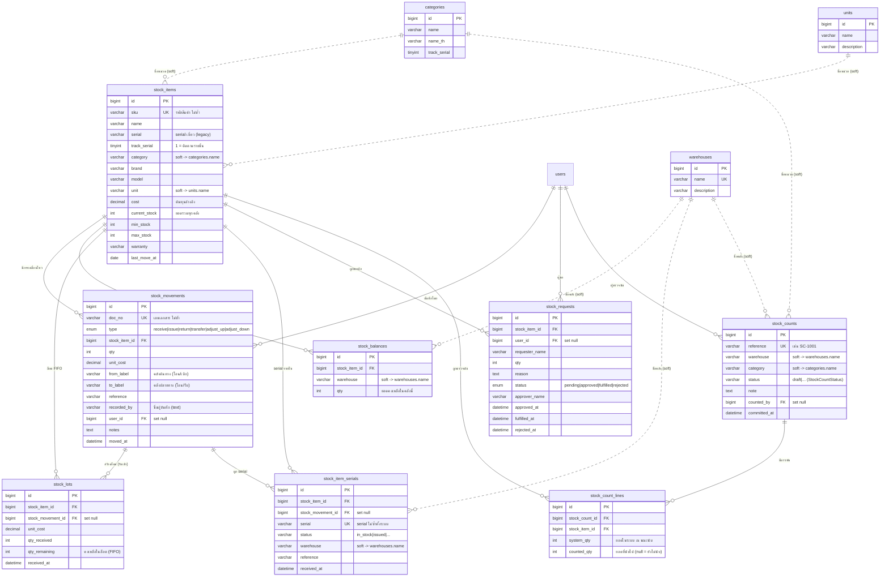

# Stock Management Module — ER Diagram

เอกสารนี้อธิบายโครงสร้างฐานข้อมูลของ **Module 6 — Stock Management** (คลังอะไหล่ รับเข้า–เบิกออก) ของระบบ IT Service Desk
สร้างจาก schema จริงในฐานข้อมูล `itservices_v200` (MySQL)

---

## 1. ภาพรวม

โมดูล Stock ประกอบด้วยตารางหลัก 9 ตาราง + ตาราง master ที่อ้างถึงอีก 4 ตาราง

| กลุ่ม | ตาราง | หน้าที่ |
|------|-------|---------|
| สินค้า (Master) | `stock_items` | นิยาม SKU แต่ละชนิด + ยอดคงเหลือรวม (`current_stock`) |
| บัญชีเคลื่อนไหว | `stock_movements` | Ledger บันทึกทุกการเคลื่อนไหว (รับ/เบิก/คืน/โอน/ปรับ) |
| ยอดคงเหลือต่อคลัง | `stock_balances` | ยอดคงเหลือแยกตามคลัง (warehouse-aware) |
| ต้นทุน FIFO | `stock_lots` | ล็อตรับเข้าแต่ละครั้ง เพื่อคำนวณต้นทุนแบบ FIFO |
| Serial Number | `stock_item_serials` | ติดตามรายชิ้นสำหรับสินค้าที่ `track_serial = 1` |
| คำขอเบิก | `stock_requests` | Workflow ขอเบิก → อนุมัติ → จ่ายออก |
| ตรวจนับสต็อก | `stock_counts`, `stock_count_lines` | เอกสารตรวจนับ (Stock Count / Audit) |
| Master | `warehouses` | คลังสินค้า (มี FK / unique ชื่อ) |
| Master (อ้างชื่อ) | `categories`, `units` | หมวดหมู่ / หน่วยนับ |

> **หมายเหตุสำคัญเรื่องความสัมพันธ์**
> ฟิลด์ `warehouse`, `category`, `unit` ในตาราง stock ถูกเก็บเป็น **ชื่อ (varchar)** ไม่ใช่ foreign key
> จึงเป็น **Soft link** (อ้างด้วยค่าชื่อที่ตรงกับ `warehouses.name` / `categories.name` / `units.name`)
> หมายเหตุ: `stock_items` ไม่มีคอลัมน์ `warehouse`/`supplier` แล้ว — คลังของ SKU ดูจาก `stock_balances` (รายคลัง) และผู้จำหน่ายบันทึกที่ `from_label` ของ movement ตอนรับเข้า
> ส่วนความสัมพันธ์ที่เป็น **Hard FK** จริงจะเชื่อมด้วย `*_id` เสมอ

---

## 2. ER Diagram (Mermaid)

> `||--o{` = ความสัมพันธ์แบบ FK จริง (one-to-many, hard) · `||..o{` = soft link อ้างด้วยชื่อ (ไม่มี foreign key)

---

## 3. รายละเอียดความสัมพันธ์ (Foreign Keys จริง)

| ตารางลูก | คอลัมน์ | อ้างไปยัง | On Delete |
|----------|---------|-----------|-----------|
| `stock_movements` | `stock_item_id` | `stock_items.id` | **cascade** |
| `stock_movements` | `user_id` | `users.id` | set null |
| `stock_balances` | `stock_item_id` | `stock_items.id` | **cascade** |
| `stock_lots` | `stock_item_id` | `stock_items.id` | **cascade** |
| `stock_lots` | `stock_movement_id` | `stock_movements.id` | set null |
| `stock_item_serials` | `stock_item_id` | `stock_items.id` | **cascade** |
| `stock_item_serials` | `stock_movement_id` | `stock_movements.id` | set null |
| `stock_requests` | `stock_item_id` | `stock_items.id` | **cascade** |
| `stock_requests` | `user_id` | `users.id` | set null |
| `stock_counts` | `counted_by` | `users.id` | set null |
| `stock_count_lines` | `stock_count_id` | `stock_counts.id` | **cascade** |
| `stock_count_lines` | `stock_item_id` | `stock_items.id` | **cascade** |

**Soft link (อ้างด้วยชื่อ varchar — ไม่มี FK):**

| ตาราง | คอลัมน์ | อ้างชื่อจาก |
|-------|---------|-------------|
| `stock_items` | `category` / `unit` | `categories.name` / `units.name` |
| `stock_balances` | `warehouse` | `warehouses.name` |
| `stock_item_serials` | `warehouse` | `warehouses.name` |
| `stock_counts` | `warehouse` / `category` | `warehouses.name` / `categories.name` |

---

## 4. Unique Constraints ที่ควรรู้

| ตาราง | Unique key | ความหมาย |
|-------|-----------|----------|
| `stock_items` | `sku` | รหัส SKU ห้ามซ้ำ |
| `stock_movements` | `doc_no` | เลขเอกสารห้ามซ้ำ |
| `stock_balances` | (`stock_item_id`, `warehouse`) | 1 SKU มีได้ 1 แถวต่อคลัง |
| `stock_item_serials` | `serial` | serial number ห้ามซ้ำทั้งระบบ |
| `stock_counts` | `reference` | เลขเอกสารตรวจนับห้ามซ้ำ (auto `SC-####`) |
| `warehouses` | `name` | ชื่อ master ห้ามซ้ำ |

---

## 5. หมายเหตุเชิงตรรกะ (Business Logic)

- **ยอดคงเหลือ 2 ระดับ:** `stock_items.current_stock` = ยอดรวมทุกคลัง ส่วน `stock_balances.qty` = ยอดแยกรายคลัง (ผลรวมของ balances ต้องเท่ากับ current_stock)
- **ประเภทการเคลื่อนไหว (`stock_movements.type`):**
  - เพิ่มสต็อก (INBOUND): `receive`, `return`, `adjust_up`
  - ลดสต็อก: `issue`, `adjust_down`
  - เป็นกลาง (ไม่กระทบยอดรวม): `transfer` — ย้ายระหว่างคลังด้วย `from_label` → `to_label`
- **FIFO:** ทุกครั้งที่ `receive` จะสร้าง `stock_lots` 1 ล็อต (`qty_remaining` ลดลงเมื่อเบิก) ใช้คำนวณมูลค่าสต็อกและต้นทุนเฉลี่ย
- **Serial:** สินค้าที่ `track_serial = 1` จะสร้างแถวใน `stock_item_serials` ผูกกับ `stock_movement_id` ที่รับเข้า และเปลี่ยน `status` เมื่อถูกจ่ายออก
- **คำขอเบิก:** `stock_requests` เดินตาม workflow `pending → approved → fulfilled` (หรือ `rejected`) เมื่อ fulfilled จะสร้าง movement ชนิด `issue`
- **ตรวจนับ:** `stock_count_lines.variance` = `counted_qty − system_qty` เมื่อ commit เอกสารจะปรับยอดด้วย movement ชนิด `adjust_up` / `adjust_down`
